# SUND-IBTA-G2

## A CLI tool for Banking Transaction Management.


### Setup
Clone the repository
```sh
git clone git@github.com:quebeco52/SUND-IBTA-G2.git
cd SUND-IBTA-G2
npm install
```

### Start the server and CLI:

```sh
npx tsx src/server.ts
npx tsx src/cli.ts
```


The folder "data" contanis two *.json files:
- transactions.json (ten transactions as a starting point)
- classifications.json (ten classifications for our unique transactions)


The first thing that appears once the banking terminal starts is the main menu (see image below):

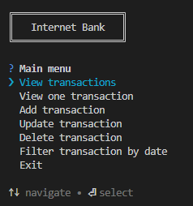

Use the arrow keys to navigate through the menu choices and press Enter to select the current (highlighted) choice.
Below follows all the menu choices, their route, route type and function

1. View transactions
Route: "/transactions"
Type: GET
Function: Displays all the transactions in a table format (see image below)
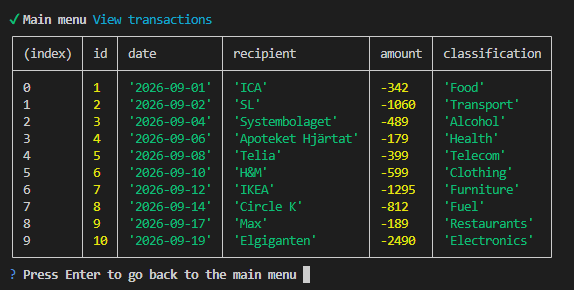

2. View one transaction
    Route: "/transactions/:id"
    Type: GET
    Function: Displays a single transaction using the id provided by the user (see image below)
    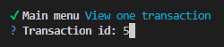

    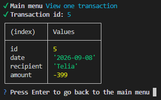

3. Add transaction
    Route: "/transactions"
    Type: POST
    Function: Adds a new transaction where the user must provide the data (Date, Recipient and Amount)

    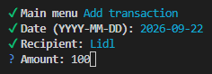

    After we add a new transaction with "Lidl" as a new recipient, the list of transactions will look like the image below. The classification is "Unknown" in this case for the Lidl transaction since the classifications.json file does not contain Lidl as a "verified/known" recipient.

    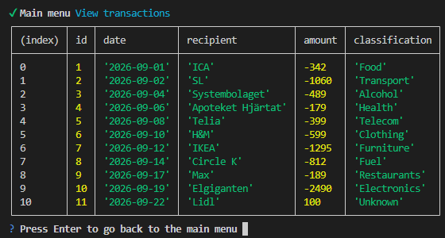

4. Update transaction
    Route: "/transactions/:id"
    Type: PUT
    Function: Updates an existing transaction where the user must provide the transaction id, followed by any updates in Date, Recipient or Amount

    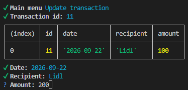

5. Delete transaction
    Route: "/transactions/:id"
    Type: DELETE
    Function: Deletes an existing transaction where the user must provide the transaction id

    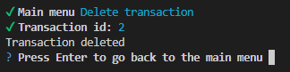

6. Filter transactions by date
    Route: "/transactions/filterbydate"
    Type: GET
    Function: Selects existing transactions between a start date and an end date. Both dates are provided by the user

    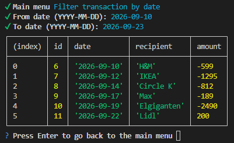

7. Exit
    Closes our bank terminal application
----------------------------

### Error handling
We used both regex and the Zod package for error handling to eliminate the chance for data corruption.
The messages received by the user are user friendly and look like the following images:

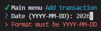

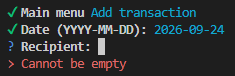

